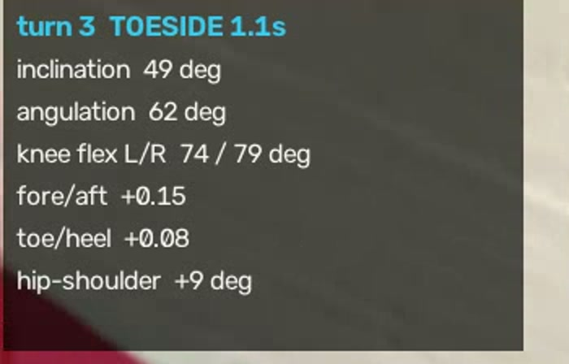
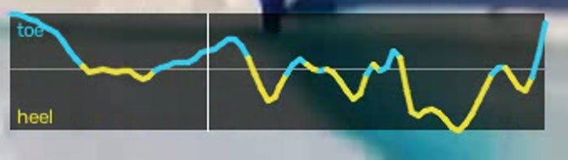

# snowboard

3D pose analysis of snowboard riding, built on Meta's
[SAM 3D Body](https://github.com/facebookresearch/sam-3d-body), to turn footage of a
run into specific, actionable technique feedback.

*One frame of `overlay.mp4`: projected mesh and skeleton on the tracked rider, the
board axes fitted to the feet, the metrics panel, and the scrolling toe/heel trace
whose sign changes mark the turns. Two other riders are in shot; the tracker holds
the one it locked on.*

## What it measures

Every number is expressed in a frame fitted to the rider's own feet, so it is
independent of camera angle — no world-up or gravity estimate needed. Inclination
is lean relative to the board; angulation is the bend at the hip that lets you hold
an edge without leaning; fore/aft is where the mass sits along the board.

The centre of mass crosses the board at every edge change, so turns segment from
the sign changes of this trace — cyan toeside, yellow heelside.

## The board comes from the feet

SAM 3D Body has no notion of a snowboard, but MHR70 gives heels and toe tips and
both feet are strapped to the deck. Red is a detected snowboard mask's principal
axis; cyan is the axis recovered from the feet alone.

They agree to a **median 1.3°** — p25 0.5°, p75 2.5°, 98% within 15° — measured
across **771 frames** of a clip where the rider was large enough for the segmenter
to find the board reliably. On the broadcast frame shown above, where the rider is
only 267 px tall and just 15 frames produced a mask, agreement was 3.2°. Chance
would be 45° either way.

## Status

Validated end to end on an 8x RTX 6000D box: the model runs on real
snowboard-cross frames and the recovered mesh lands correctly on a rider in a deep
carve, wearing helmet, goggles and bulky kit. See `docs/design.md` for the output
schema, the coordinate-frame findings, and the metric design.

## Layout

    snowpose/
      mhr.py        MHR70 joint indices (from the model's own metadata)
      model.py      SAM 3D Body wrapper, kept loaded across frames
      video.py      cv2 decode, shot-cut detection
      track.py      greedy IoU tracking + primary-subject selection
      geometry.py   board frame from the feet; all per-frame metrics
      smooth.py     Hampel despike + Savitzky-Golay
      turns.py      stance orientation, turn segmentation, symmetry
      report.py     ranked findings and drills
      overlay.py    skeleton, board axes, metrics HUD, edge trace
    scripts/
      analyze_run.py           video segment -> overlay + CSV + report
      find_segments.py         locate segments worth analysing in a long video
      check_stability.py       measure board-frame jitter on real footage
      smoke_test.py            validate the install, print output conventions
      patch_dinov3_offline.py  stop the backbone load hanging without egress
    docs/design.md  what the model gives us, how the metrics are derived, results
    footage/        clips (gitignored)

## Usage

    python scripts/find_segments.py --video run.mp4          # where is the riding?
    python scripts/analyze_run.py --video run.mp4 --start 120 --end 150 \
        --stance regular --out out/

Writes `overlay.mp4`, `metrics.csv`, `turns.json` and `report.md`. Pass
`--stance regular|goofy` when you know it; `auto` infers it from where the rider
looks and prints its confidence.

## Setup

Needs a CUDA GPU. SAM 3D Body itself is a separate install:

1. Clone [SAM 3D Body](https://github.com/facebookresearch/sam-3d-body) and follow
   its `INSTALL.md` (python 3.11, torch, detectron2 at the pinned commit).
2. **Request access** to the checkpoints on Hugging Face — they are gated and
   approved manually by Meta: [`facebook/sam-3d-body-dinov3`](https://huggingface.co/facebook/sam-3d-body-dinov3).
   Then `hf download facebook/sam-3d-body-dinov3 --local-dir checkpoints/sam-3d-body-dinov3`.
3. Install this package's requirements (`numpy`, `opencv-python`, `ultralytics`) into
   the same environment, and make `sam_3d_body` importable (`PYTHONPATH=/path/to/sam-3d-body`).

Paths come from the environment, with defaults matching the layout above:

    SAM3D_CKPT          checkpoints/sam-3d-body-dinov3/model.ckpt
    SAM3D_MHR_PATH      checkpoints/sam-3d-body-dinov3/assets/mhr_model.pt
    SNOWPOSE_DETECTOR   person detector weights   (default yolo11x.pt)
    SNOWPOSE_SEGMENTOR  segmentation weights      (default yolo11x-seg.pt)

Then verify the install and print the model's output conventions:

    python scripts/smoke_test.py --frames ./frames --dets ./dets.json

Read `docs/design.md` before trusting the report: the geometry is verified
against synthetic ground truth and real footage, but the coaching thresholds are
uncalibrated heuristics that currently flag an elite racer's deliberate forward
stance as a fault.

Two gotchas are documented in `docs/design.md` and worth reading before touching the
install: `pyrender` cannot load (no libEGL, no sudo — project the mesh with numpy
instead), and the DINOv3 backbone fetches code via `torch.hub` on every load, which
needs a pre-populated cache on a box that cannot reach GitHub reliably.
