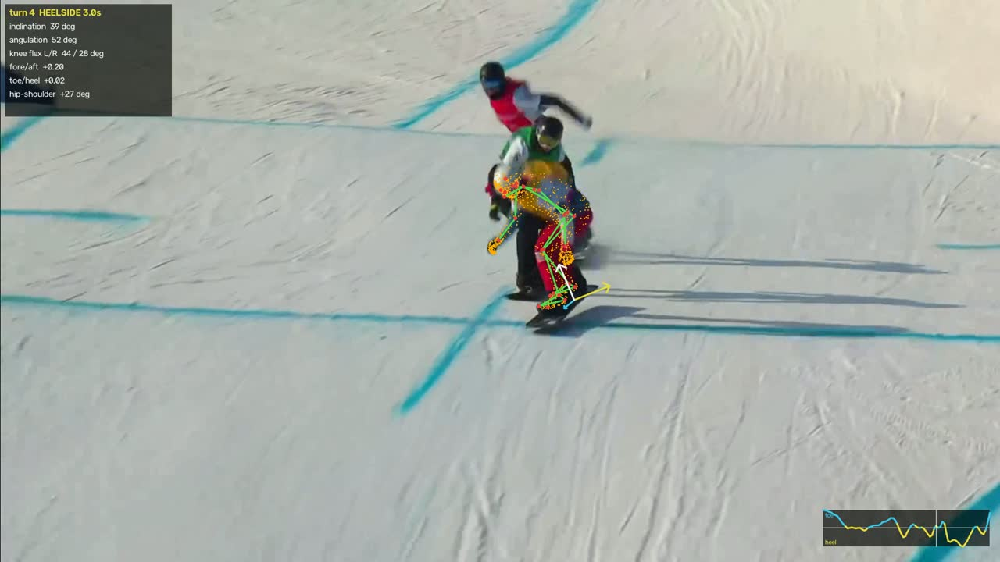
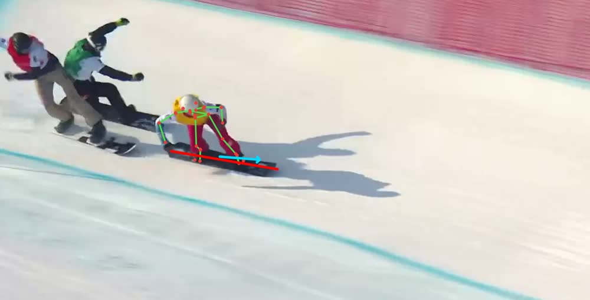

# Snowboard pose analysis on SAM 3D Body — design

## What the model gives us

`SAM3DBodyEstimator.process_one_image(img, bboxes=...)` returns one dict per person.
Verified on real snowboard-cross frames (2026-09-07):

| field | shape | notes |
|---|---|---|
| `pred_keypoints_3d` | (70, 3) | MHR70 joints, **metres**, camera-space, root-relative |
| `pred_keypoints_2d` | (70, 2) | image pixels — free overlay, no projection needed |
| `pred_vertices` | (18439, 3) | mesh; `faces` is (36874, 3) |
| `pred_cam_t` | (3,) | root translation; z was ~8.9 m on the test shot |
| `focal_length` | scalar | predicted pinhole focal, px |
| `pred_global_rots` | (127, 3, 3) | per-joint global rotation matrices |
| `global_rot` | (3,) | body orientation in camera frame |
| `body_pose_params` / `shape_params` / `scale_params` | (133,) / (45,) / (28,) | MHR parameters |

Measured sanity on a carving rider: nose→ankle 1.18 m, ankle separation 0.38 m.

## The two constraints that shape everything

**1. There is no board.** SAM 3D Body is body-only. But MHR70 includes
`heel`, `big_toe_tip` and `small_toe_tip` for both feet (indices 15-20), and both
feet are strapped to the board. So the board plane is recoverable from the feet:

- board long axis  `L = ankle_L - ankle_R`
- toe direction    `T = mean(toe - heel)` over both feet
- board normal     `N = L × T`, then re-orthogonalise

That makes YOLO board detection a *refinement* (it pins the board's true edges and
catches boot/binding offsets), not a prerequisite.

**2. World-up is unknown.** The model works per-frame in camera space, and the
camera on real footage is tilted, moving, or both. The "vertical axis" test on a
crouched rider is inconclusive by construction — the body's long axis projected
mostly onto camera X in our test shot.

So **every MVP metric is expressed in the board frame `(L, T, N)`**, which is
rotation-invariant and needs no gravity estimate. Absolute edge angle relative to
the slope is the one thing that genuinely needs world-up, and it is deferred.

The coaching-relevant substitute is available body-relatively: **inclination** =
angle between the body's stacking axis (`hip_mid → neck`) and the board normal.
During a carve the rider's apparent vertical (gravity + centripetal) is what they
stack against, so this is arguably the more useful number than absolute edge angle.

## Metrics (board frame, no world-up needed)

- **Fore/aft balance** — COM projected on `L`, relative to ankle midpoint. The
  classic beginner fault (sitting back) shows up here.
- **Toe/heel balance** — COM projected on `T`. Signs the edge being ridden.
- **Knee / ankle flexion** — joint angles from `pred_keypoints_3d`; absorption and
  "stack". Independent of camera entirely.
- **Inclination vs angulation** — whole-body lean vs hip/knee bending. The
  distinction every carving coach teaches.
- **Upper/lower separation** — hip axis vs shoulder axis twist; counter-rotation.
- **Stance symmetry** — left vs right leg flexion difference.

## Turn segmentation

Toe/heel balance (COM on `T`) changes sign at each edge change, so turns segment
from its zero crossings without any world frame. Per-turn scoring then compares
toeside against heelside, and turn-to-turn consistency.

## Pipeline

    footage → frames (cv2) → YOLO person boxes → SAM 3D Body per frame
            → subject tracking → temporal smoothing → board frame → metrics
            → turn segmentation → overlay video + metrics CSV + coaching report

## Known risks

- Rider height in frame was a median 176 px on the test footage. It works, but
  quality degrades on small subjects; chairlift-distance footage will be weak.
- Per-frame inference means jitter. Smoothing is required before differentiating
  anything.
- Two riders in shot: subject selection must be tracked, not per-frame "tallest".

## Validation results (2026-09-07)

**Board frame holds up.** Measured on 36 tracked frames of snowboard-cross
footage at 25 fps:

- **zero** left/right leg swaps across 35 adjacent frame pairs — the model's leg
  labelling is temporally consistent, so no temporal L/R disambiguation is needed
- heel→toe length 0.201–0.207 m (MHR has a fixed foot), so the toe direction never
  collapses and `N` is always well-conditioned
- deck planarity median 0.052, p90 0.109 — the four foot points really are close to
  a plane
- stance width median 0.413 m, std 0.090 m

**But it is noisy.** Board axes rotate a median 5.5°/frame (p90 13°, max 64°), and
knee flexion moves 3.5–4.9°/frame against signal ranges of 20–35°. Hence
`smooth.py`: Hampel despiking then Savitzky-Golay, which cuts noise 3.5× on a
turn-shaped signal while preserving amplitude. Order is joints → smooth → metrics,
never metrics → smooth, because the angle computations are non-linear.

**End-to-end run** on a 20 s race segment (`--start 1184 --end 1204`): 3 shots
detected, an 11 s shot chosen, one rider tracked at 267 px mean height through
82 frames while two other riders were in shot, stance auto-inferred as regular,
and **4 turns segmented (2 toeside, 2 heelside)** with durations 0.88–2.96 s.
Mean inclination 33.8°, angulation 53.2°, knee flexion 75.2°.

## The thresholds are not calibrated

On that segment the report flags "mass too far forward" (fore/aft +0.106) as its
top finding. The subject is a World Universiade snowboard-cross racer, and an
aggressive forward stance is *correct* technique for racing — so this is a false
positive produced by thresholds meant for recreational riding.

That is the honest state of `report.py`: the geometry is verified, the coaching
thresholds are informed guesses. They live in one dict (`report.THRESHOLDS`) so
they can be recalibrated against footage of a rider whose level is known. Until
then, treat the *measurements* as sound and the *verdicts* as provisional.

## A turn-segmentation trap, found and fixed

A raw zero-crossing split over-segments. A rider holding one long edge produces
brief opposite-sign wobbles as the smoothed centre of mass crosses the board's
centreline, and every wobble cut a turn in two. On this segment a single 2.96 s
heelside turn came apart into three "turns" separated by blips of 0.08–0.24 s with
peaks as low as 0.003 — which both inflated the turn count and made the
"inconsistency" finding partly an artifact of its own fragmentation.

Discarding sub-threshold segments is not enough; they have to be *absorbed* and
the same-edge neighbours either side merged. Three consecutive same-edge turns in
the output is the signature of getting this wrong, since zero-crossings alone can
never produce one.

## A near-miss: the offset that was not an offset

Two Mixkit clips both measured a `toe_heel` median of **-0.0695 and -0.0693**.
Two unrelated riders landing on the same number to four decimal places looks
exactly like a geometric bias — plausibly the body's mass projecting near the
ankles, which sit heel-ward of the heel/toe midpoint used as the frame origin.
Subtracting a per-run baseline duly "fixed" the segmentation, turning one clip's
single long turn into four.

It was wrong. Two checks killed it:

1. A third clip, of racers, sat at median **-0.006 with 46% of samples positive**
   and 14 zero crossings. A constant offset would have pushed that clip negative
   too. The metric is well centred.
2. Frame-by-frame inspection of the Mixkit clip showed the rider on the **heel
   edge for all 24 seconds** — a heelside descent, never once switching to toe.

So the "offset" was two riders genuinely riding one edge, and the baseline
correction was inventing turns from the neutral middle of a heelside descent,
including a 10.7 s phantom "toeside". Absolute zero was right all along.

The lesson kept in the code: **riding one edge the whole way down is real, common,
and the single most useful thing to say about such a run** — so it is now a
first-class finding (`single_edge`) rather than something a normalisation hides.
`rolling_baseline` survives as opt-in, documented with why it is off.

## Still open

- **Absolute edge angle** needs world-up. Candidate: fit the slope plane to foot
  contact points across a run, which is self-contained but needs camera motion
  compensation.
- **Fusing the board mask into the 3D fit**, to pin true edges and correct for
  boot and binding offsets. The cross-check above validates the feet-only frame;
  fusion would tighten it.
- **Threshold calibration** against footage of riders whose level is known.
- Rider height in frame drives quality; chairlift-distance footage will be weak.

## The foot-derived board frame checks out against pixels (validated)

The design's load-bearing claim is that the rider's feet recover the board's
orientation. That is now tested against independent evidence rather than assumed.
COCO includes `snowboard` (class 31), and a *segmentation mask* yields a genuine
2D long axis — a bounding box does not, since a box carries no orientation.

`scripts/check_board_axis.py` compares the mask's principal axis against the
foot-derived long axis projected through the model's own predicted camera. Both
axes are sign-ambiguous, so agreement folds to [0°, 90°] where 0 is perfect and
random chance sits near 45°.

On the 82-frame race segment, 15 frames had an associated snowboard mask:

| statistic | agreement |
|---|---|
| median | **3.2°** |
| p25 / p75 | 1.9° / 5.6° |
| within 15° | 87% |
| chance | ~45° |

So the feet do recover the board's plane, to a few degrees. Only 15 of 82 frames
produced a mask — `yolo26n-seg` is a nano model and the boards are small and
motion-blurred — so this is a decisive spot-check, not a dense measurement. A
larger seg model would give a denser one.

This makes board detection a *refinement* rather than a dependency, as designed:
fusing the mask into the 3D fit to pin true edges and correct boot/binding offsets
remains future work.

## Example output

Skeleton and projected mesh on the tracked rider, board axes at the feet, the
metrics HUD, and the scrolling toe/heel trace whose sign changes mark the turns.

The validation view: red is the detected snowboard mask's principal axis, cyan is
the foot-derived long axis projected through the model's own camera.
